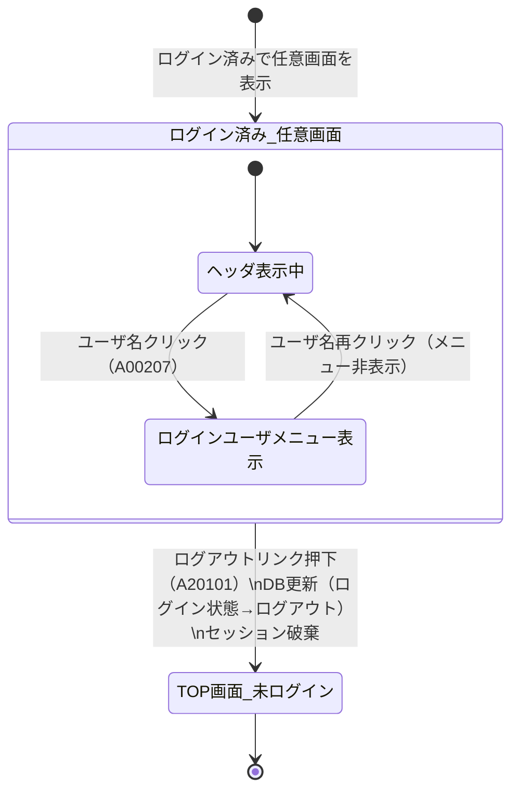

# ログアウトプロセス 状態遷移図

対象画面：ヘッダ部品（A002）  
対象イベント：A20101（ログアウトリンク押下）  
参照：ATRS 外部設計書 Markdown版 第1.7.0版

---

## 状態遷移図

---

## 状態一覧

| 状態 | 説明 |
| :--- | :--- |
| ログイン済み_任意画面 | セッションが確立されており、任意の画面を表示中 |
| ログインユーザメニュー表示 | ヘッダのユーザ名クリックによりドロップダウンメニューが開いた状態 |
| TOP画面_未ログイン | ログアウト処理完了後、セッションが破棄された TOP 画面（未ログイン状態） |

---

## 遷移一覧

| # | 遷移元 | 遷移先 | イベント | 条件 |
| :--- | :--- | :--- | :--- | :--- |
| 1 | 任意画面 | ログイン済み_任意画面 | ログイン成功（A10101） | - |
| 2 | ヘッダ表示中 | ログインユーザメニュー表示 | ユーザ名クリック（A00207） | ログイン済み |
| 3 | ログインユーザメニュー表示 | ヘッダ表示中 | ユーザ名再クリック | - |
| 4 | ログイン済み_任意画面 | TOP画面_未ログイン | ログアウトリンク押下（A20101） | ログイン済み |

---

## ログアウト後処理詳細（遷移 #4）

| # | 処理内容 |
| :--- | :--- |
| 1 | DB の「ログイン状態」を「ログアウト」に更新 |
| 2 | セッションを破棄 |
| 3 | TOP 画面（A001）を表示。ヘッダが未ログイン状態（「会員登録」「ログイン」ボタン表示）になる |
