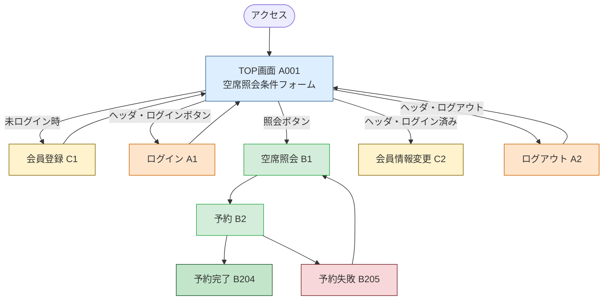
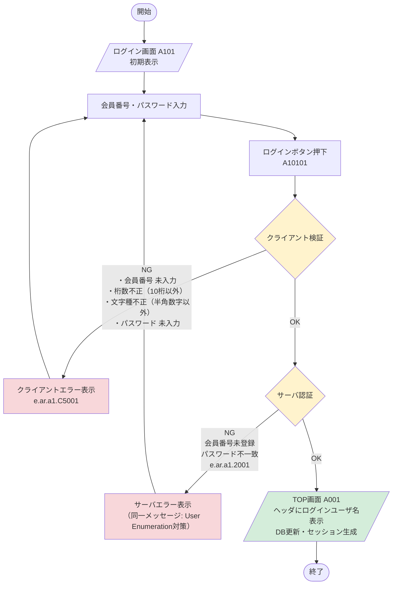
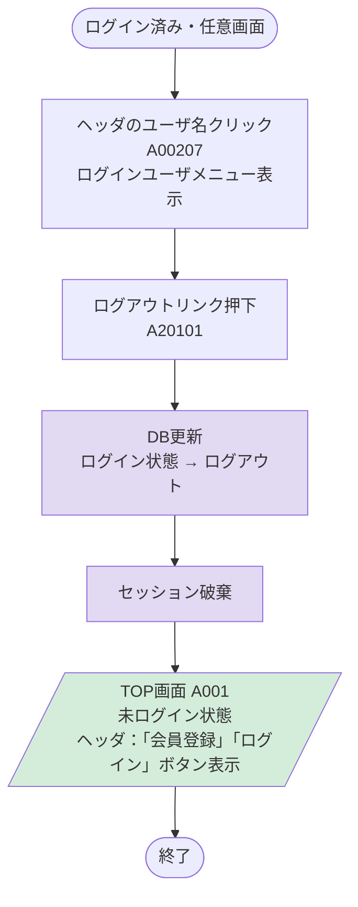
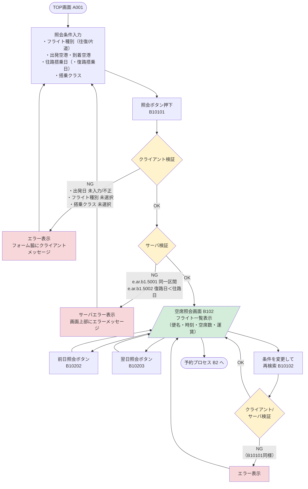
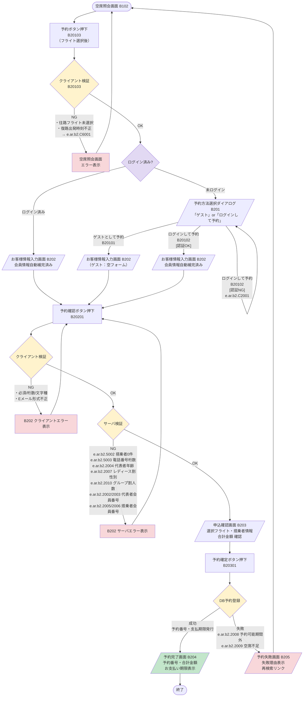
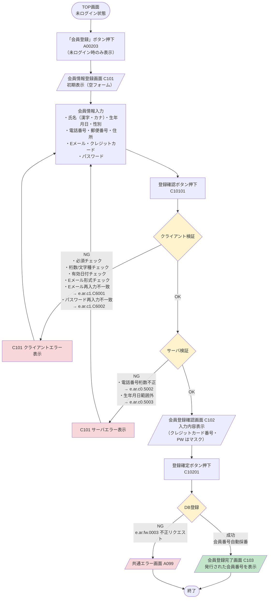
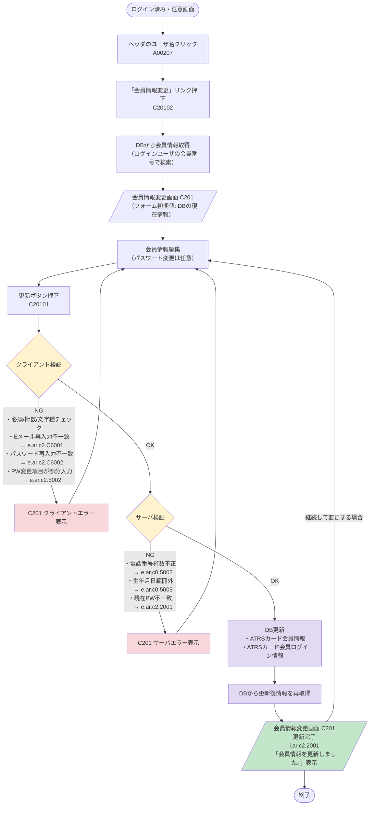

# ATRS 全プロセス フローモデリング図

対象システム：航空チケット予約システム（ATRS）  
参照：ATRS 外部設計書 Markdown版 第1.7.0版  
作成日：2026-05-08

---

## 1. システム全体概要フロー

---

## 2. A1 ログインプロセス

---

## 3. A2 ログアウトプロセス

---

## 4. B1 空席照会プロセス

---

## 5. B2 予約プロセス

---

## 6. C1 会員情報登録プロセス

---

## 7. C2 会員情報変更プロセス

