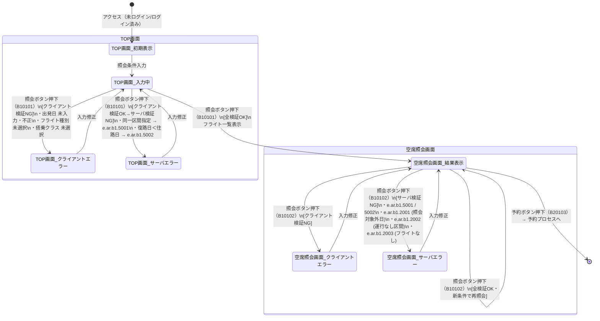

# 空席照会プロセス 状態遷移図

対象画面：TOP画面（A001）、空席照会条件入力部品（B101）、空席照会画面（B102）  
対象イベント：B10101（照会ボタン・TOP画面）、B10102（照会ボタン・空席照会画面）、B10202（前日照会）、B10203（翌日照会）  
参照：ATRS 外部設計書 Markdown版 第1.7.0版

---

## 状態遷移図

---

## 状態一覧

| 状態 | 説明 |
| :--- | :--- |
| TOP画面_初期表示 | フォーム初期値あり（往復・東京(羽田)・当日・一般席）のボタン押下待ち状態 |
| TOP画面_入力中 | 照会条件を入力済み、またはエラー修正後のボタン押下待ち状態 |
| TOP画面_クライアントエラー | Parsley による入力チェック NG。エラーメッセージをフォーム脇に表示 |
| TOP画面_サーバエラー | サーバ側ビジネスルール NG。エラーメッセージを画面上部に表示 |
| 空席照会画面_結果表示 | 照会結果（空席一覧）を表示中。画面上部に再検索フォームあり |
| 空席照会画面_クライアントエラー | 再検索時クライアントエラー表示状態 |
| 空席照会画面_サーバエラー | 再検索時サーバエラー表示状態 |

---

## 遷移一覧

| # | 遷移元 | 遷移先 | イベント | 条件 |
| :--- | :--- | :--- | :--- | :--- |
| 1 | [開始] | TOP画面_初期表示 | アクセス | - |
| 2 | TOP画面_初期表示 | TOP画面_入力中 | 照会条件入力 | - |
| 3 | TOP画面_入力中 | TOP画面_クライアントエラー | 照会ボタン押下（B10101） | クライアント検証NG |
| 4 | TOP画面_クライアントエラー | TOP画面_入力中 | 入力修正 | - |
| 5 | TOP画面_入力中 | TOP画面_サーバエラー | 照会ボタン押下（B10101） | クライアントOK・サーバ検証NG |
| 6 | TOP画面_サーバエラー | TOP画面_入力中 | 入力修正 | - |
| 7 | TOP画面_入力中 | 空席照会画面_結果表示 | 照会ボタン押下（B10101） | 全検証OK |
| 8 | 空席照会画面_結果表示 | 空席照会画面_クライアントエラー | 照会ボタン押下（B10102） | クライアント検証NG |
| 9 | 空席照会画面_クライアントエラー | 空席照会画面_結果表示 | 入力修正 | - |
| 10 | 空席照会画面_結果表示 | 空席照会画面_サーバエラー | 照会ボタン押下（B10102） | クライアントOK・サーバ検証NG |
| 11 | 空席照会画面_サーバエラー | 空席照会画面_結果表示 | 入力修正 | - |
| 12 | 空席照会画面_結果表示 | 空席照会画面_結果表示 | 照会ボタン押下（B10102） | 全検証OK（新条件で再照会） |
| 13 | 空席照会画面_結果表示 | 空席照会画面_結果表示 | 前日照会（B10202）／翌日照会（B10203） | - |
| 14 | 空席照会画面_結果表示 | [予約プロセス] | 予約ボタン押下（B20103） | - |

---

## サーバ検証エラー一覧（遷移 #5, #10 の条件詳細）

| エラーコード | メッセージ | 発生条件 |
| :--- | :--- | :--- |
| e.ar.b1.5001 | 出発空港と到着空港に同じ空港は指定できません | 出発＝到着の同一区間 |
| e.ar.b1.5002 | 復路搭乗日は往路搭乗日以降である必要があります | 往復時に復路日＜往路日 |
| e.ar.b1.2001 | 空席照会対象外の搭乗日が入力されています | 照会可能期間外の搭乗日 |
| e.ar.b1.2002 | ご指定の区間は運行しておりません | 非運行区間 |
| e.ar.b1.2003 | ご指定の条件に合致するフライトはございません | 検索結果0件 |
