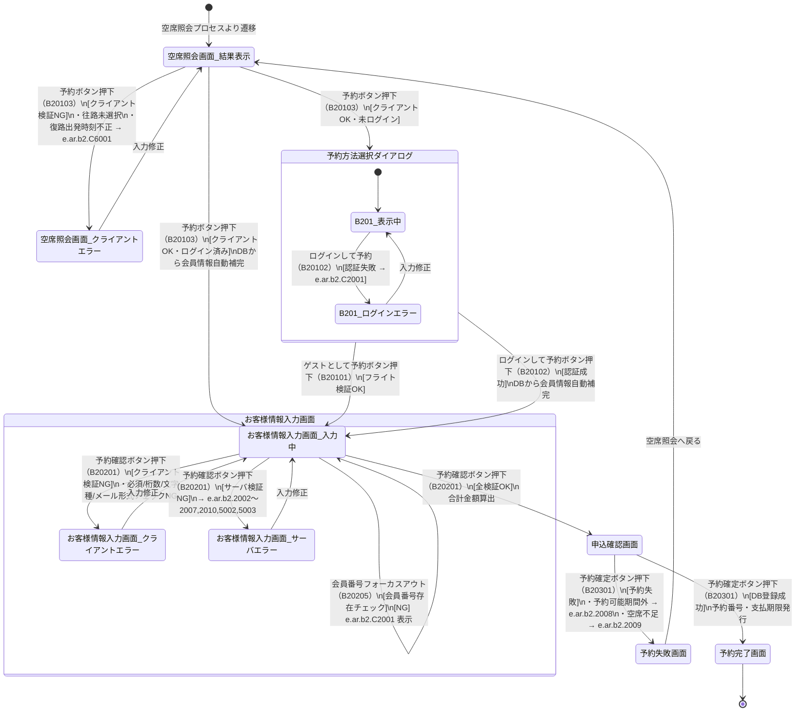

# 予約プロセス 状態遷移図

対象画面：空席照会画面（B102）、予約方法選択部品（B201）、お客様情報入力画面（B202）、申込確認画面（B203）、予約完了画面（B204）、予約失敗画面（B205）  
対象イベント：B20101（ゲスト予約）、B20102（ログイン予約）、B20103（予約ボタン押下）、B20201（予約確認ボタン）、B20205（会員番号フォーカスアウト）、B20301（予約確定ボタン）  
参照：ATRS 外部設計書 Markdown版 第1.7.0版

---

## 状態遷移図

---

## 状態一覧

| 状態 | 説明 |
| :--- | :--- |
| 空席照会画面_結果表示 | 空席照会結果一覧と予約ボタンを表示中 |
| 空席照会画面_クライアントエラー | 予約ボタン押下時のクライアント検証 NG（フライト未選択等） |
| 予約方法選択ダイアログ（B201） | 未ログイン時に表示するモーダルダイアログ。「ゲスト予約」「ログインして予約」を選択 |
| お客様情報入力画面_入力中（B202） | 搭乗者情報・予約代表者情報を入力中 |
| お客様情報入力画面_クライアントエラー | クライアント検証 NG。入力フォームにエラーメッセージ表示 |
| お客様情報入力画面_サーバエラー | サーバ検証 NG（会員番号不一致等）。画面上部にエラー表示 |
| 申込確認画面（B203） | 選択フライト・搭乗者情報・合計金額の確認画面 |
| 予約完了画面（B204） | 予約成功。予約番号・支払期限・合計金額を表示 |
| 予約失敗画面（B205） | 予約失敗。失敗理由メッセージと再検索リンクを表示 |

---

## 遷移一覧

| # | 遷移元 | 遷移先 | イベント | 条件 |
| :--- | :--- | :--- | :--- | :--- |
| 1 | 空席照会画面 | 空席照会画面_クライアントエラー | 予約ボタン押下（B20103） | クライアント検証NG |
| 2 | 空席照会画面_クライアントエラー | 空席照会画面 | 入力修正 | - |
| 3 | 空席照会画面 | 予約方法選択ダイアログ | 予約ボタン押下（B20103） | クライアントOK・未ログイン |
| 4 | 空席照会画面 | お客様情報入力画面_入力中 | 予約ボタン押下（B20103） | クライアントOK・ログイン済み |
| 5 | 予約方法選択ダイアログ | お客様情報入力画面_入力中 | ゲストとして予約（B20101） | フライト検証OK |
| 6 | 予約方法選択ダイアログ | お客様情報入力画面_入力中 | ログインして予約（B20102） | 認証成功 |
| 7 | お客様情報入力画面_入力中 | お客様情報入力画面_クライアントエラー | 予約確認ボタン押下（B20201） | クライアント検証NG |
| 8 | お客様情報入力画面_クライアントエラー | お客様情報入力画面_入力中 | 入力修正 | - |
| 9 | お客様情報入力画面_入力中 | お客様情報入力画面_サーバエラー | 予約確認ボタン押下（B20201） | サーバ検証NG |
| 10 | お客様情報入力画面_サーバエラー | お客様情報入力画面_入力中 | 入力修正 | - |
| 11 | お客様情報入力画面_入力中 | 申込確認画面 | 予約確認ボタン押下（B20201） | 全検証OK |
| 12 | 申込確認画面 | 予約完了画面 | 予約確定ボタン押下（B20301） | 予約成功 |
| 13 | 申込確認画面 | 予約失敗画面 | 予約確定ボタン押下（B20301） | 空席不足・期限切れ等 |
| 14 | 予約失敗画面 | 空席照会画面 | 空席照会へ戻るリンク | - |

---

## サーバ検証エラー一覧（遷移 #9 の条件詳細）

| エラーコード | メッセージ概要 | 発生条件 |
| :--- | :--- | :--- |
| e.ar.b2.5002 | お客様情報を入力してください | 搭乗者情報が0件 |
| e.ar.b2.5003 | 電話番号桁数不正 | 市外局番＋市内局番の合計が6〜7桁以外 |
| e.ar.b2.2004 | 予約代表者は{0}歳以上必要 | 代表者年齢が未満 |
| e.ar.b2.2007 | レディース割は全員女性必要 | 搭乗者に男性が含まれる |
| e.ar.b2.2010 | グループ割の最少人数未満 | 搭乗者数が利用可能最少人数未満 |
| e.ar.b2.2002 | 代表者会員番号が確認できない | 代表者の会員番号が DB に未登録 |
| e.ar.b2.2003 | 代表者情報と会員情報が不一致 | 代表者の氏名・性別が DB 会員情報と不一致 |
| e.ar.b2.2005 | 搭乗者会員番号が確認できない | 搭乗者の会員番号が DB に未登録 |
| e.ar.b2.2006 | 搭乗者情報と会員情報が不一致 | 搭乗者の氏名・性別が DB 会員情報と不一致 |

## 予約確定失敗エラー一覧（遷移 #13 の条件詳細）

| エラーコード | メッセージ概要 | 発生条件 |
| :--- | :--- | :--- |
| e.ar.b2.2008 | 予約可能時期外のフライトあり | 搭乗日が運賃種別の予約可能前日数範囲外 |
| e.ar.b2.2009 | 座席が確保できなかった | 確定時点で空席不足（他者が先に確保） |
