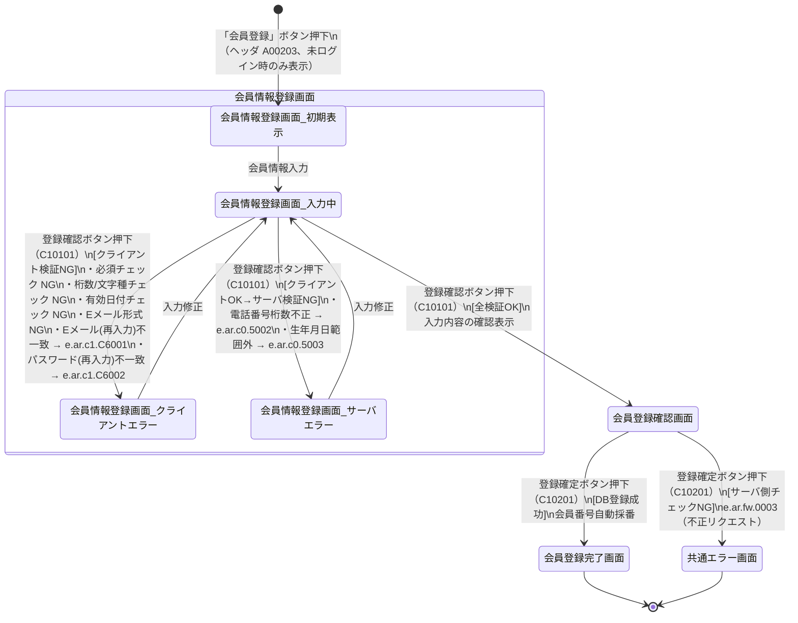

# 会員情報登録プロセス 状態遷移図

対象画面：会員情報登録画面（C101）、会員登録確認画面（C102）、会員登録完了画面（C103）  
対象イベント：C10101（登録確認ボタン押下）、C10201（登録確定ボタン押下）  
参照：ATRS 外部設計書 Markdown版 第1.7.0版

---

## 状態遷移図

---

## 状態一覧

| 状態 | 説明 |
| :--- | :--- |
| 会員情報登録画面_初期表示 | フォーム空白・エラーなしの初期状態（C101） |
| 会員情報登録画面_入力中 | 会員情報を入力済み、またはエラー修正後のボタン押下待ち状態 |
| 会員情報登録画面_クライアントエラー | クライアント検証NG。フォーム脇/上部にエラーメッセージ表示 |
| 会員情報登録画面_サーバエラー | サーバ検証NG（電話番号桁数・生年月日範囲外）。エラーメッセージ表示 |
| 会員登録確認画面（C102） | 入力内容マスクあり（クレジットカード番号・パスワード等）で確認表示 |
| 会員登録完了画面（C103） | 登録成功。発行された会員番号を表示 |
| 共通エラー画面（A099） | 不正リクエスト等のシステムエラー発生時 |

---

## 遷移一覧

| # | 遷移元 | 遷移先 | イベント | 条件 |
| :--- | :--- | :--- | :--- | :--- |
| 1 | [開始] | 会員情報登録画面_初期表示 | 会員登録ボタン押下（A00203） | 未ログイン状態 |
| 2 | 会員情報登録画面_初期表示 | 会員情報登録画面_入力中 | 会員情報入力 | - |
| 3 | 会員情報登録画面_入力中 | 会員情報登録画面_クライアントエラー | 登録確認ボタン押下（C10101） | クライアント検証NG |
| 4 | 会員情報登録画面_クライアントエラー | 会員情報登録画面_入力中 | 入力修正 | - |
| 5 | 会員情報登録画面_入力中 | 会員情報登録画面_サーバエラー | 登録確認ボタン押下（C10101） | クライアントOK・サーバ検証NG |
| 6 | 会員情報登録画面_サーバエラー | 会員情報登録画面_入力中 | 入力修正 | - |
| 7 | 会員情報登録画面_入力中 | 会員登録確認画面 | 登録確認ボタン押下（C10101） | 全検証OK |
| 8 | 会員登録確認画面 | 会員登録完了画面 | 登録確定ボタン押下（C10201） | DB登録成功 |
| 9 | 会員登録確認画面 | 共通エラー画面 | 登録確定ボタン押下（C10201） | サーバ検証NG（e.ar.fw.0003） |

---

## クライアント検証ルール（遷移 #3 の条件詳細）

| 項目 | チェック種別 | エラーメッセージ |
| :--- | :--- | :--- |
| 漢字姓・漢字名・カナ姓・カナ名 | 必須・文字種チェック | クライアントメッセージ |
| 生年月日 | 必須・有効日付チェック | クライアントメッセージ |
| 電話番号 | 必須・半角数字チェック | クライアントメッセージ |
| 郵便番号 | 必須・半角数字チェック | クライアントメッセージ |
| Eメール | 必須・形式チェック | クライアントメッセージ |
| Eメール（再入力） | 一致チェック | e.ar.c1.C6001 |
| パスワード | 必須・文字種チェック | クライアントメッセージ |
| パスワード（再入力） | 一致チェック | e.ar.c1.C6002 |
| クレジットカード番号 | 必須・桁数チェック | クライアントメッセージ |

## サーバ検証ルール（遷移 #5 の条件詳細）

| エラーコード | メッセージ概要 | 発生条件 |
| :--- | :--- | :--- |
| e.ar.c0.5002 | 市外局番と市内局番の合計桁数が6〜7桁の範囲外 | 電話番号1＋電話番号2の合計文字数が6〜7文字以外 |
| e.ar.c0.5003 | 生年月日は{0}から{1}まで | 生年月日が現在日-120年〜現在日の範囲外 |
