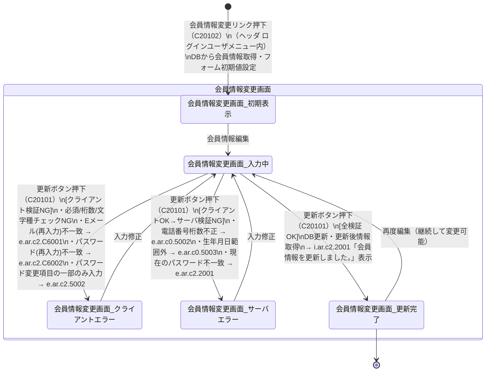

# 会員情報変更プロセス 状態遷移図

対象画面：会員情報変更画面（C201）  
対象イベント：C20102（会員情報変更リンク押下）、C20101（更新ボタン押下）  
参照：ATRS 外部設計書 Markdown版 第1.7.0版

---

## 状態遷移図

---

## 状態一覧

| 状態 | 説明 |
| :--- | :--- |
| 会員情報変更画面_初期表示 | DBから取得した現在の会員情報がフォームに設定されている初期状態（C201） |
| 会員情報変更画面_入力中 | 会員情報を編集中、またはエラー修正後のボタン押下待ち状態 |
| 会員情報変更画面_クライアントエラー | クライアント検証NG。エラーメッセージをフォーム脇/上部に表示 |
| 会員情報変更画面_サーバエラー | サーバ検証NG（電話番号桁数・生年月日範囲外・パスワード不一致）。エラーメッセージ表示 |
| 会員情報変更画面_更新完了 | 更新成功。同一画面（C201）に i.ar.c2.2001 の INFO メッセージ表示、DBの更新後情報がフォームに反映 |

---

## 遷移一覧

| # | 遷移元 | 遷移先 | イベント | 条件 |
| :--- | :--- | :--- | :--- | :--- |
| 1 | [開始] | 会員情報変更画面_初期表示 | 会員情報変更リンク押下（C20102） | ログイン済み |
| 2 | 会員情報変更画面_初期表示 | 会員情報変更画面_入力中 | 会員情報編集 | - |
| 3 | 会員情報変更画面_入力中 | 会員情報変更画面_クライアントエラー | 更新ボタン押下（C20101） | クライアント検証NG |
| 4 | 会員情報変更画面_クライアントエラー | 会員情報変更画面_入力中 | 入力修正 | - |
| 5 | 会員情報変更画面_入力中 | 会員情報変更画面_サーバエラー | 更新ボタン押下（C20101） | クライアントOK・サーバ検証NG |
| 6 | 会員情報変更画面_サーバエラー | 会員情報変更画面_入力中 | 入力修正 | - |
| 7 | 会員情報変更画面_入力中 | 会員情報変更画面_更新完了 | 更新ボタン押下（C20101） | 全検証OK |
| 8 | 会員情報変更画面_更新完了 | 会員情報変更画面_入力中 | 再度編集 | - |

---

## クライアント検証ルール（遷移 #3 の条件詳細）

| 項目 | チェック種別 | エラーメッセージ |
| :--- | :--- | :--- |
| 漢字姓・漢字名・カナ姓・カナ名 | 必須・文字種チェック | クライアントメッセージ |
| 生年月日 | 必須・有効日付チェック | クライアントメッセージ |
| 電話番号 | 必須・半角数字チェック | クライアントメッセージ |
| Eメール | 必須・形式チェック | クライアントメッセージ |
| Eメール（再入力） | 一致チェック | e.ar.c2.C6001 |
| 変更するパスワード（再入力） | 一致チェック | e.ar.c2.C6002 |
| パスワード変更項目の部分入力 | 相関チェック（3項目セット必須） | e.ar.c2.5002 |

## サーバ検証ルール（遷移 #5 の条件詳細）

| エラーコード | メッセージ概要 | 発生条件 |
| :--- | :--- | :--- |
| e.ar.c0.5002 | 市外局番と市内局番の合計桁数が6〜7桁の範囲外 | 電話番号1＋電話番号2の合計文字数が6〜7文字以外 |
| e.ar.c0.5003 | 生年月日は{0}から{1}まで | 生年月日が現在日-120年〜現在日の範囲外 |
| e.ar.c2.2001 | 入力された現在のパスワードが一致しません | パスワード変更時に現在のパスワードが DB と不一致 |

## 更新完了後の処理詳細（遷移 #7）

| # | 処理内容 |
| :--- | :--- |
| 1 | DB の「ATRSカード会員情報」「ATRSカード会員ログイン情報」を更新 |
| 2 | DB から更新後の「ATRSカード会員情報」を取得 |
| 3 | 会員情報変更画面（C201）を再表示。フォームに更新後情報を設定 |
| 4 | 画面上部に INFO メッセージ i.ar.c2.2001「会員情報を更新しました。」を表示 |
