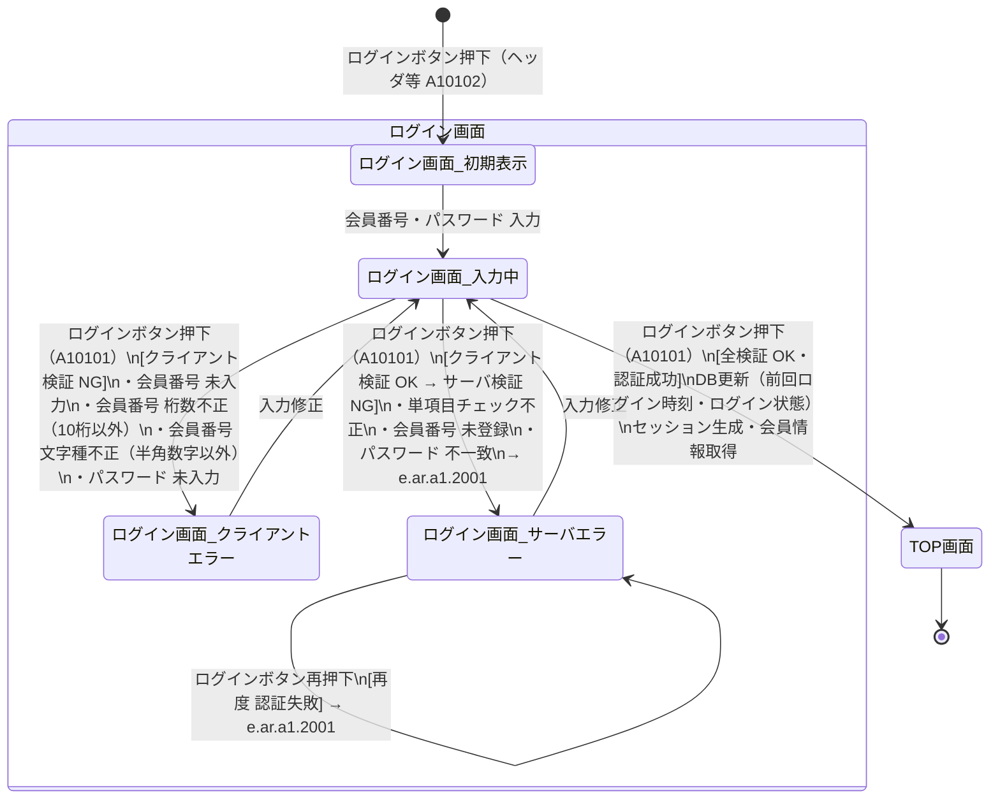

# ログインプロセス 状態遷移図

対象画面：ログイン画面（A101）  
対象イベント：A10101（ログインボタン押下）、A10102（ログインボタン押下・ヘッダ）  
参照：ATRS 外部設計書 Markdown版 第1.7.0版

---

## 状態遷移図

---

## 状態一覧

| 状態 | 説明 |
| :--- | :--- |
| ログイン画面_初期表示 | フォーム空白・エラーなしの初期状態 |
| ログイン画面_入力中 | 入力済み、またはエラー修正後のボタン押下待ち状態 |
| ログイン画面_クライアントエラー | クライアント側検証 NG。エラーメッセージ（e.ar.a1.C5001）を表示 |
| ログイン画面_サーバエラー | サーバ側認証失敗。エラーメッセージ（e.ar.a1.2001）を表示 |
| TOP画面 | ログイン成功・セッション確立済み |

---

## 遷移一覧

| # | 遷移元 | 遷移先 | イベント | 条件 |
| :--- | :--- | :--- | :--- | :--- |
| 1 | 任意画面（未ログイン） | ログイン画面_初期表示 | ログインボタン押下（A10102） | - |
| 2 | ログイン画面_初期表示 | ログイン画面_入力中 | 会員番号・パスワード入力 | - |
| 3 | ログイン画面_入力中 | ログイン画面_クライアントエラー | ログインボタン押下（A10101） | クライアント検証 NG |
| 4 | ログイン画面_クライアントエラー | ログイン画面_入力中 | 入力修正 | - |
| 5 | ログイン画面_入力中 | ログイン画面_サーバエラー | ログインボタン押下（A10101） | クライアント OK・サーバ検証 NG |
| 6 | ログイン画面_サーバエラー | ログイン画面_入力中 | 入力修正 | - |
| 7 | ログイン画面_サーバエラー | ログイン画面_サーバエラー | ログインボタン再押下（A10101） | 再度 認証失敗 |
| 8 | ログイン画面_入力中 | TOP画面 | ログインボタン押下（A10101） | 全検証 OK・認証成功 |

---

## クライアント検証ルール（遷移 #3 の条件詳細）

| 項目 | チェック種別 | 条件 | エラーメッセージ |
| :--- | :--- | :--- | :--- |
| 会員番号 | 必須チェック | 未入力 | 会員番号を入力してください |
| 会員番号 | 桁数チェック | 10桁以外 | e.ar.a1.C5001「10文字で入力してください。」 |
| 会員番号 | 文字種チェック | 半角数字以外 | 半角数字でなければなりません |
| パスワード | 必須チェック | 未入力 | パスワードを入力してください |

> **注意：** パスワードのクライアント側チェックは必須のみ。桁数（8〜20桁）・文字種（全角＋半角）はサーバ側でのみ検証する。

---

## サーバ検証ルール（遷移 #5・#7 の条件詳細）

| # | サーバ処理 | 失敗時の出力先 | エラーメッセージ |
| :--- | :--- | :--- | :--- |
| 1 | 単項目チェック（桁数・文字種） | ログイン画面（A101） | e.ar.a1.2001 |
| 2 | 会員番号による DB 検索 | ログイン画面（A101） | e.ar.a1.2001 |
| 3 | パスワード照合 | ログイン画面（A101） | e.ar.a1.2001 |

> **セキュリティ上の注意：** 「会員番号が存在しない」と「パスワードが一致しない」は意図的に同一エラーメッセージ（e.ar.a1.2001）で返す。ユーザ列挙攻撃（User Enumeration）対策。

---

## ログイン成功後の処理（遷移 #8 の後処理詳細）

| # | 処理内容 |
| :--- | :--- |
| 1 | DB の「前回ログイン時刻」をシステム日時に更新 |
| 2 | DB の「ログイン状態」を「ログイン中」に更新 |
| 3 | DB から会員情報（お客様氏名 姓・名）を取得 |
| 4 | セッションにログインユーザ情報を保持 |
| 5 | TOP画面（A001）を表示。ヘッダにログインユーザ名を表示 |
