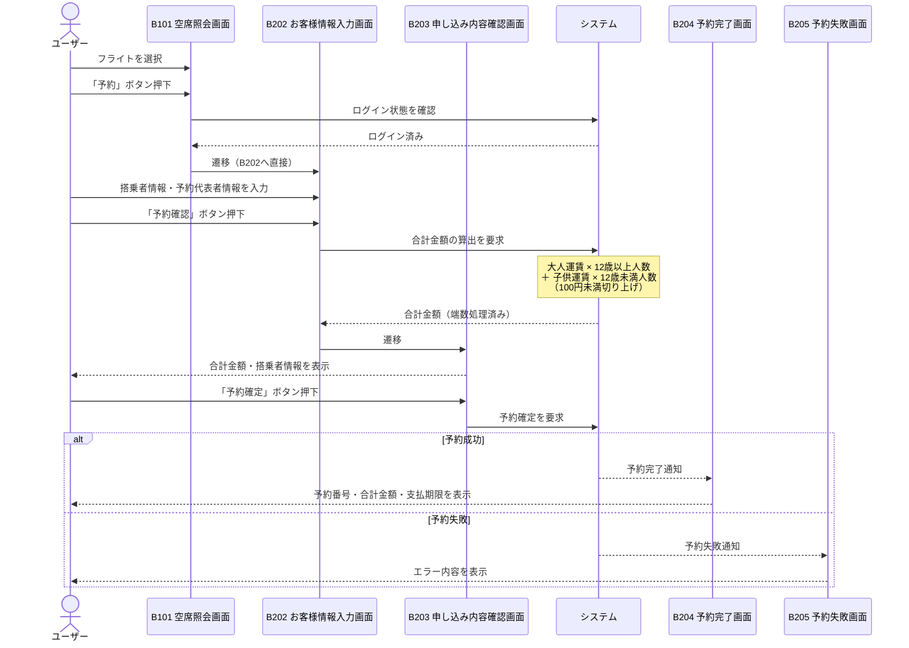

# 課題9 テスト設計

対象機能：ATRS チケット予約機能（合計金額算出・片道フライト予約フロー）

---

## 1. シーケンス図（テストモデル）

ログイン済みユーザーが片道フライトを予約する流れ。



---

## 2. テスト条件一覧（合計金額算出ルール）

### 仕様

```
合計金額 = 運賃 × 搭乗者数（12歳以上）
         + （基本運賃 × 60% − 運賃種別ごとの割引額）× 搭乗者数（12歳未満）

端数処理：合計金額の100円未満は切り上げ
```

### 有効同値パーティション（正常系）

| No | 同値クラス | 条件 | 12歳以上 | 12歳未満 | 端数 | 期待結果 |
|----|-----------|------|---------|---------|------|---------|
| 1 | 12歳以上のみ | 搭乗者が全員12歳以上 | 1名以上 | 0名 | - | 大人運賃のみで合計算出 |
| 2 | 12歳未満のみ | 搭乗者が全員12歳未満 | 0名 | 1名以上 | - | 子供運賃のみで合計算出 |
| 3 | 年齢区分混在 | 12歳以上と12歳未満が混在 | 1名以上 | 1名以上 | - | 大人・子供それぞれ算出し合算 |
| 4 | 端数あり | 合計金額に100円未満の端数が生じる | - | - | 端数あり | 100円未満を切り上げた金額 |
| 5 | 端数なし | 合計金額が100円の倍数でぴったり | - | - | 端数なし | 切り上げ不発生・金額そのまま |

### 無効同値パーティション（異常系）

| No | 同値クラス | 条件 | 12歳以上 | 12歳未満 | 期待結果 |
|----|-----------|------|---------|---------|---------|
| 6 | 搭乗者数ゼロ | 搭乗者数の合計が0名 | 0名 | 0名 | エラー（予約不可） |
| 7 | 搭乗者数が負 | 12歳以上の搭乗者数に負数を指定 | 負数 | - | 入力エラー |
| 8 | 搭乗者数が負 | 12歳未満の搭乗者数に負数を指定 | - | 負数 | 入力エラー |
| 9 | 子供運賃が不正 | 基本運賃×60% ＜ 運賃種別の割引額（子供運賃がマイナスになる） | - | 1名以上 | 運賃計算エラー |

### 同値分割の分類根拠

| 分類軸 | 同値クラス | 根拠 |
|--------|-----------|------|
| 年齢 | 12歳以上 | 運賃そのまま適用 |
| 年齢 | 12歳未満 | 基本運賃×60%から割引後の運賃を適用 |
| 端数処理 | 100円未満あり | 切り上げロジックが発動する |
| 端数処理 | 100円未満なし | 切り上げロジックが発動しない |
| 搭乗者数 | 1以上の整数 | 有効な予約が成立する |
| 搭乗者数 | 0以下の整数 | 予約が成立しない |

---

## 3. テストケース一覧（全8件）

適用技法：同値分割法・境界値分析（ISO/IEC/IEEE 29119-4・JSTQB準拠）

| TC ID | 適用技法 | 搭乗者の年齢構成 | 期待する合計金額の考え方 |
|-------|---------|---------------|----------------------|
| TC-EP-01 | 同値分割 | 12歳以上 1名・12歳未満 0名 | 大人料金のみ（運賃 × 1） |
| TC-EP-02 | 同値分割 | 12歳以上 0名・12歳未満 1名 | 子供料金のみ（基本運賃×60%−割引額）× 1 |
| TC-EP-03 | 同値分割 | 12歳以上 1名・12歳未満 1名 | 大人料金＋子供料金の合算 |
| TC-EP-04 | 同値分割 | 合計金額に100円未満の端数が生じる構成 | 100円未満を切り上げた金額 |
| TC-EP-05 | 同値分割 | 合計金額が100円の倍数になる構成 | 切り上げ不発生・計算結果そのまま |
| TC-BV-01 | 境界値分析 | 11歳 1名（12歳未満クラスの上限境界直前） | 子供料金が適用される |
| TC-BV-02 | 境界値分析 | 12歳 1名（12歳以上クラスの下限境界値） | 大人料金が適用される |
| TC-BV-03 | 境界値分析 | 13歳 1名（境界直後・大人クラス内側） | 大人料金が適用される |

### セルフレビュー結果（ISO/IEC/IEEE 29119-4・JSTQB）

| 確認観点 | 判定 | 備考 |
|---------|------|------|
| 同値分割：有効クラスの網羅 | OK | 12歳以上のみ・12歳未満のみ・混在・端数あり・端数なし すべてカバー |
| 同値分割：無効クラスの網羅 | OK | 搭乗者数0は算出対象外のため除外が妥当 |
| 境界値分析：11歳（境界直前） | 補完済み | TC-BV-01 で追加 |
| 境界値分析：12歳（境界値） | 補完済み | TC-BV-02 で追加 |
| 境界値分析：13歳（境界直後） | 補完済み | TC-BV-03 で追加（ISO 29119-4 の3点分析を満たす） |

> **補完根拠：** JSTQB は境界の両側（2点）、ISO 29119-4 は境界の前・境界・直後（3点）の確認を要求する。年齢クラスの分岐は11歳と12歳の間にあるため、TC-BV-01〜03 の3点で境界ロジックが正しく動作することを確認する。
