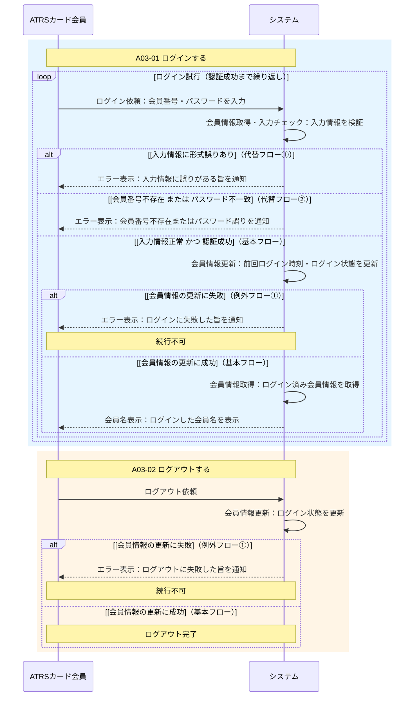

# ログイン・ログアウト シーケンス図（テストモデル）

ユースケース仕様 A03-01（ログインする）・A03-02（ログアウトする）をテストベースとしたシーケンス図。

## フローと構造の対応

| フロー | 表現手段 |
|--------|---------|
| 基本フロー：正常ログイン | `else [入力情報正常 かつ 認証成功]` → `else [更新成功]` の連鎖 |
| 代替フロー①：入力情報誤り | `alt [入力情報に形式誤りあり]` |
| 代替フロー②：認証失敗 | `else [会員番号不存在 または パスワード不一致]` |
| 例外フロー①（ログイン時） | `alt [会員情報の更新に失敗]` + `Note: 続行不可` |
| 基本フロー：正常ログアウト | `else [会員情報の更新に成功]` |
| 例外フロー①（ログアウト時） | `alt [会員情報の更新に失敗]` + `Note: 続行不可` |
| 代替フロー①②からの再試行 | `loop` ブロック全体で「認証成功まで繰り返し」を表現 |

## カバレッジアイテム一覧（シナリオ）

| # | シナリオの経路 | 終端 |
|---|-------------|------|
| S01 | ログイン依頼 → チェック → **[入力情報に形式誤りあり]** → エラー表示 → ループ継続 | ループ折り返し |
| S02 | ログイン依頼 → チェック → **[会員番号不存在 または パスワード不一致]** → エラー表示 → ループ継続 | ループ折り返し |
| S03 | ログイン依頼 → チェック → [認証成功] → 会員情報更新 → **[更新失敗]** → エラー表示 | 続行不可 |
| S04 | ログイン依頼 → チェック → [認証成功] → 会員情報更新 → [更新成功] → 会員名表示 → ログアウト依頼 → 会員情報更新 → **[更新失敗]** → エラー表示 | 続行不可 |
| S05 | ログイン依頼 → チェック → [認証成功] → 会員情報更新 → [更新成功] → 会員名表示 → ログアウト依頼 → 会員情報更新 → **[更新成功]** → ログアウト完了 | 正常終了 |

> **S01・S02 について：** ループの折り返しで図の末端には到達しないが、「エラー時に再入力へ戻る」という独立したふるまいを検証するカバレッジアイテムとして有効。
