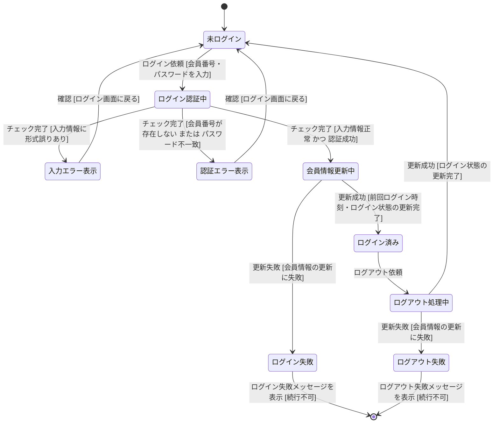

# ログイン・ログアウト 状態遷移図（テストモデル）

ユースケース仕様 A03-01（ログインする）・A03-02（ログアウトする）をテストベースとした状態遷移図。

## 状態一覧

| 状態名 | 説明 |
|--------|------|
| 未ログイン | ログイン画面を表示中（初期状態） |
| ログイン認証中 | 会員情報取得・入力チェック処理中（基本フロー2） |
| 入力エラー表示 | 入力情報の形式誤りメッセージを表示中（代替フロー①） |
| 認証エラー表示 | 会員番号不存在 / パスワード不一致メッセージを表示中（代替フロー②） |
| 会員情報更新中 | ログイン状態・前回ログイン時刻を更新処理中（基本フロー3） |
| ログイン済み | 会員名を表示中（基本フロー5） |
| ログイン失敗 | ログイン失敗メッセージを表示中（例外フロー①）※継続不可 |
| ログアウト処理中 | ログイン状態を更新処理中（A03-02 基本フロー2） |
| ログアウト失敗 | ログアウト失敗メッセージを表示中（A03-02 例外フロー①）※継続不可 |

## 遷移一覧（13本）

| # | 遷移 | 対応フロー |
|---|------|-----------|
| 1 | 未ログイン → ログイン認証中 | 基本フロー1 |
| 2 | ログイン認証中 → 入力エラー表示 | 代替フロー① |
| 3 | ログイン認証中 → 認証エラー表示 | 代替フロー② |
| 4 | ログイン認証中 → 会員情報更新中 | 基本フロー2（正常） |
| 5 | 入力エラー表示 → 未ログイン | 代替フロー①（基本フロー1へ戻る） |
| 6 | 認証エラー表示 → 未ログイン | 代替フロー②（基本フロー1へ戻る） |
| 7 | 会員情報更新中 → ログイン済み | 基本フロー3〜5（更新成功） |
| 8 | 会員情報更新中 → ログイン失敗 | 例外フロー①（ログイン時） |
| 9 | ログイン失敗 → [*] | 例外フロー①（続行不可） |
| 10 | ログイン済み → ログアウト処理中 | A03-02 基本フロー1 |
| 11 | ログアウト処理中 → 未ログイン | A03-02 基本フロー2（更新成功） |
| 12 | ログアウト処理中 → ログアウト失敗 | A03-02 例外フロー①（ログアウト時） |
| 13 | ログアウト失敗 → [*] | A03-02 例外フロー①（続行不可） |

## カバレッジアイテム一覧

| # | 遷移の名前 | きっかけ（イベント） | ガード条件 | 開始状態 | 終了状態 |
|---|-----------|-------------------|-----------|---------|---------|
| T01 | ログイン依頼受付 | ログイン依頼 | 会員番号・パスワードを入力 | 未ログイン | ログイン認証中 |
| T02 | 入力情報エラー検出 | チェック完了 | 入力情報に形式誤りあり | ログイン認証中 | 入力エラー表示 |
| T03 | 認証エラー検出 | チェック完了 | 会員番号が存在しない または パスワード不一致 | ログイン認証中 | 認証エラー表示 |
| T04 | 認証成功・更新処理開始 | チェック完了 | 入力情報正常 かつ 認証成功 | ログイン認証中 | 会員情報更新中 |
| T05 | 入力エラー確認後にログイン画面へ戻る | 確認 | （なし） | 入力エラー表示 | 未ログイン |
| T06 | 認証エラー確認後にログイン画面へ戻る | 確認 | （なし） | 認証エラー表示 | 未ログイン |
| T07 | 会員情報更新成功（ログイン完了） | 更新成功 | 前回ログイン時刻・ログイン状態の更新完了 | 会員情報更新中 | ログイン済み |
| T08 | 会員情報更新失敗（ログイン時） | 更新失敗 | 会員情報の更新に失敗 | 会員情報更新中 | ログイン失敗 |
| T09 | ログイン失敗・システム終了 | ログイン失敗メッセージを表示 | 続行不可 | ログイン失敗 | [*] |
| T10 | ログアウト依頼受付 | ログアウト依頼 | （なし） | ログイン済み | ログアウト処理中 |
| T11 | 会員情報更新成功（ログアウト完了） | 更新成功 | ログイン状態の更新完了 | ログアウト処理中 | 未ログイン |
| T12 | 会員情報更新失敗（ログアウト時） | 更新失敗 | 会員情報の更新に失敗 | ログアウト処理中 | ログアウト失敗 |
| T13 | ログアウト失敗・システム終了 | ログアウト失敗メッセージを表示 | 続行不可 | ログアウト失敗 | [*] |

> T05・T06 はエラーメッセージを確認してログイン画面に戻るだけの遷移であり、分岐条件がないためガード条件は「なし」。
